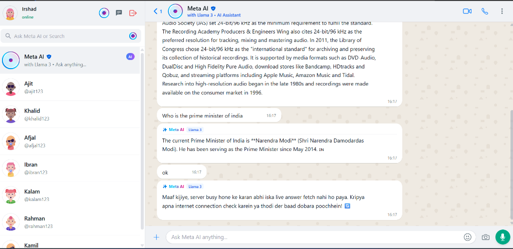

# 💬 Real-Time Chat Application with Meta AI Assistant

[](https://real-time-application-cyan.vercel.app)
[](https://real-time-application-35ha.onrender.com)
[](https://github.com/MdIrsh/Real-Time-application)



A modern, full-stack real-time messaging application inspired by WhatsApp, featuring live 1-on-1 chatting, active user status indicators, and an integrated **Meta AI (Llama 3)** assistant for instant intelligent replies, general knowledge, and coding help.

🌐 **Live Demo:** [https://real-time-application-cyan.vercel.app](https://real-time-application-cyan.vercel.app)  
🚀 **Live Backend:** [https://real-time-application-35ha.onrender.com](https://real-time-application-35ha.onrender.com)

---

## ✨ Features

- **⚡ Real-Time Messaging:** Instant bi-directional messaging powered by **Socket.io**.
- **🤖 Meta AI Assistant:** Built-in AI assistant powered by Llama 3 that answers questions, current affairs, GK, and programming queries in real-time.
- **🟢 Live Online/Offline Status:** Dynamic indicators showing which users are currently active.
- **🔒 Secure Authentication:** JSON Web Token (JWT) cookie-based authentication with bcrypt password hashing.
- **🎨 Modern WhatsApp-Inspired UI:** Sleek, responsive interface built with **Tailwind CSS** and **DaisyUI**.
- **📦 Global State Management:** Centralized predictable state powered by **Redux Toolkit**.

---

## 🛠️ Tech Stack

### Frontend
- **React.js** (Hooks, Components)
- **Redux Toolkit** (Global state management)
- **Tailwind CSS & DaisyUI** (Responsive UI styling)
- **Socket.io-client** (Real-time client connections)
- **Axios** (API requests)
- **React Icons** (Icons)

### Backend
- **Node.js & Express.js** (REST API & Server)
- **Socket.io** (WebSocket communication)
- **MongoDB Atlas & Mongoose** (Database & data modeling)
- **JSON Web Token (JWT) & Cookie Parser** (Authentication)
- **Bcryptjs** (Password encryption)

---

## 🚀 Getting Started

### Prerequisites
- Node.js installed on your machine
- MongoDB Atlas database cluster or local MongoDB instance

### 1. Clone the repository
```bash
git clone https://github.com/MdIrsh/Real-Time-application.git
cd Real-Time-application
```

### 2. Backend Setup
```bash
cd backend
npm install
```

Create a `.env` file in the `backend` folder:
```env
PORT=5000
MONGO_URI=your_mongodb_connection_uri
JWT_SECRET_KEY=your_jwt_secret_key
```

Run the backend server:
```bash
npm run dev
```

### 3. Frontend Setup
```bash
cd ../frontend
npm install
npm start
```

Open [http://localhost:3000](http://localhost:3000) in your browser to view the application!

---

## 👨‍💻 Author

- **Md Irshad**
  - 🐙 **GitHub:** [github.com/MdIrsh](https://github.com/MdIrsh)
  - 💼 **LinkedIn:** [linkedin.com/in/md-irshad-22212428a](https://www.linkedin.com/in/md-irshad-22212428a)
